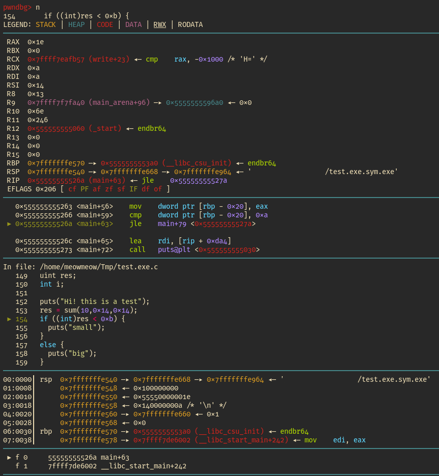
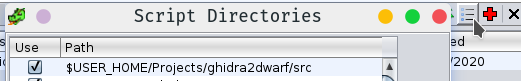
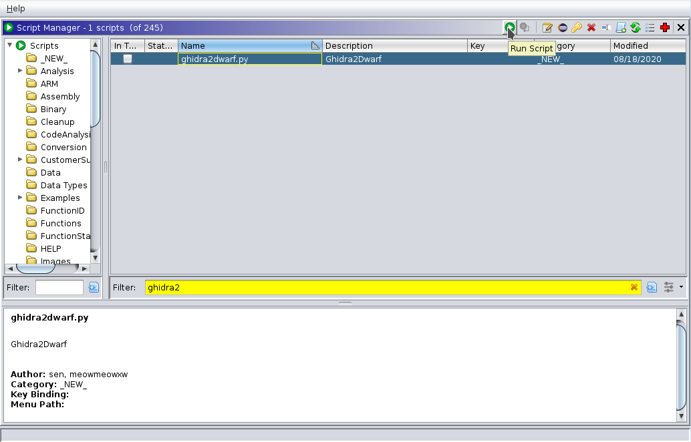
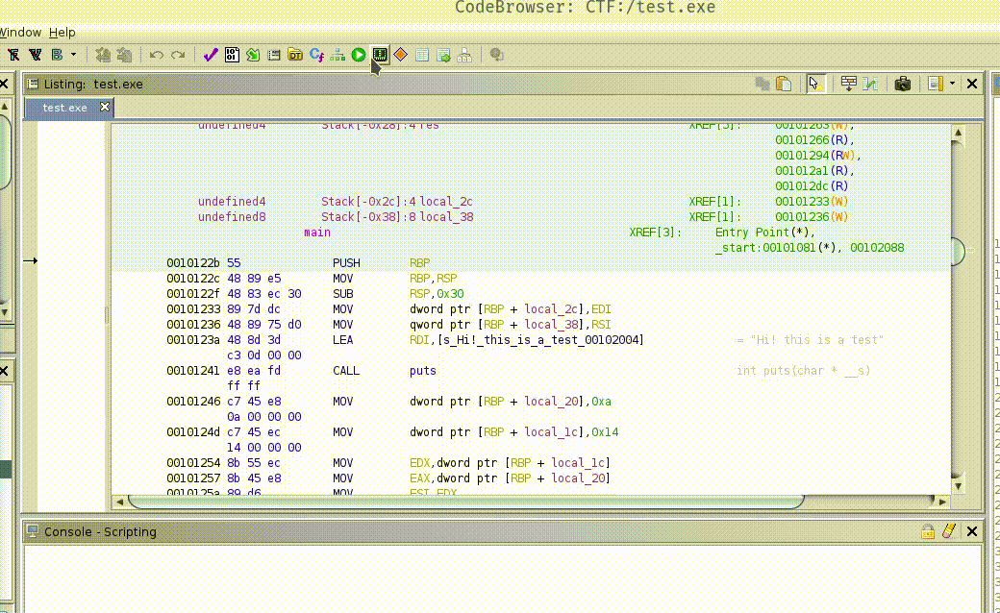

# Ghidra2Dwarf


Inspired by: [dwarfexport](https://github.com/ALSchwalm/dwarfexport)

Ghidra2Dwarf is a ghidra plugin that allows to exports informations (such as functions,
decompiled code, types) from ghidra to dwarf sections inside ELF binaries.

More specifically it exports inside a source file named `${program}.c` all the decompiled
functions, and create an ELF binary named `${program}.sym.exe` that can be used to
do source code level debugging.

Example:



Inside gdb now you can use:

1. `list <function>` to display the function's source code.
2. `n` to step one source code line instruction.
3. `ni` to step one assembly instruction.

## Install

### Linux

Bash:

```sh
git clone https://github.com/cesena/ghidra2dwarf.git
cd ghidra2dwarf
export GHIDRA_VERSION="ghidra_9.1.2_PUBLIC" # Change here with correct version
mkdir -p ~/.ghidra/.${GHIDRA_VERSION}/plugins
cp ./jnarated/target/libdwarf.jar ~/.ghidra/.${GHIDRA_VERSION}/plugins
```

### Windows

Powershell:

```powershell
git clone https://github.com/cesena/ghidra2dwarf.git
cd ghidra2dwarf
Set-Variable -Name "GHIDRA_VERSION" -Value "ghidra_9.1.2_PUBLIC"
mkdir -p ~\.ghidra\.$GHIDRA_VERSION\plugins
cp .\jnarated\target\libdwarf.jar ~\.ghidra\.$GHIDRA_VERSION\plugins
```

## Run

In the script manager -> script directories add the `src` directory:



And then run `ghidra2dwarf`:



In windows objcopy.exe is not working, so you need to do the last step on a *nix
shell:

```sh
objcopy --add-section .debug_info=.debug_info ${BINARY}.sym.exe
objcopy --add-section .debug_line=.debug_line ${BINARY}.sym.exe
objcopy --add-section .debug_abbrev=.debug_abbrev ${BINARY}.sym.exe
```

### Headless mode

#### Linux

If you saved the project and ghidra is closed, you can launch [ghidra2dwarf.sh](./src/ghidra2dwarf.sh)
to run ghidra in headless mode and export the dwarf informations:

```
./src/ghidra2dwarf.sh <Project directory> <Project name> <Binary path> <Binary>
# Example: ./src/ghidra2dwarf.sh ~/.local/share/ghidra/ TEST ~/CTF/ chall
```

#### Windows

TODO

## Known issues

* If the ELF binary is PIE, you need to rebase the memory map to the address `0`:



* Sometimes you get an `IndexError`, try to re-run the script until it works.

